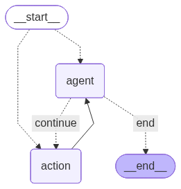

# 🤖 Agente SQL - Backend

Este repositorio contiene el backend del **Agente SQL**, una aplicación desarrollada en **Python** con **FastAPI** que utiliza modelos de lenguaje avanzados para traducir preguntas en lenguaje natural a consultas SQL, ejecutarlas en **Databricks** y devolver resultados precisos y contextualizados.

---

## ✨ Características Principales

- **Traducción de Lenguaje Natural a SQL**: Interpreta preguntas de los usuarios y las convierte en consultas SQL `SELECT`.
- **Orquestación con LangGraph**: Gestiona de forma robusta y flexible el flujo de la conversación y la ejecución de herramientas.
- **Base de Conocimiento (RAG)**: Usa **Azure AI Search** para enriquecer el contexto con ejemplos de consultas similares.
- **Conexión Segura con Databricks**: Ejecuta consultas directamente en un clúster de Databricks.
- **Almacenamiento y Auditoría**:
  - Historial de conversaciones en **Azure Cosmos DB**.
  - Resultados completos en **Azure Blob Storage** para descarga.
- **API Robusta y Escalable**: Construida con **FastAPI**, con documentación automática y alto rendimiento.

---

## 🏗️ Arquitectura

El backend sigue una **arquitectura modular y orientada a servicios**:

### Flujo del Agente (LangGraph)

El núcleo del agente está orquestado por un grafo de estados implementado con LangGraph. Este grafo define el flujo lógico que sigue el agente para procesar una pregunta, desde la búsqueda de información y la generación de la consulta SQL hasta la ejecución y el procesamiento de la respuesta final.

<div style="text-align: center; line-height: 0; padding-top: 9px;">
  
</div>


### Componentes Principales

- **API (FastAPI)**: Endpoints de interacción con el frontend.
- **Agente (LangChain & LangGraph)**: Grafo de estados, herramientas y prompts.
- **Servicios**: Comunicación con Databricks, Azure AI Search, Cosmos DB y Blob Storage.
- **Utilidades**: Wrappers y configuración para Azure OpenAI y la base de conocimiento.

---

## 🚀 Cómo Empezar

### Requisitos Previos

- **Python 3.9+**
- Cuenta de **Azure** con:
  - Azure OpenAI
  - Azure AI Search
  - Azure Cosmos DB (NoSQL)
  - Azure Blob Storage
- **Databricks** con clúster activo y token personal.

### Instalación

```bash
git clone <URL_DEL_REPOSITORIO>
cd <NOMBRE_DEL_DIRECTORIO>
```

### Configuración del Entorno

Renombra `app/.env.example` a `app/.env` y completa tus credenciales:

```ini
# --- OpenAI Configuration ---
AZURE_OPENAI_API_KEY="..."
AZURE_OPENAI_MODEL_NAME="..."
AZURE_OPENAI_ENDPOINT="..."
AZURE_OPENAI_API_VERSION="..."
AZURE_OPENAI_EMBEDDING_NAME="..."

# --- Azure Cosmos DB Configuration ---
COSMOS_DB_ENDPOINT="..."
COSMOS_DB_KEY="..."
COSMOS_DB_DATABASE_NAME="..."
COSMOS_DB_CONTAINER_NAME="..."
COSMOS_DB_RESULTS_CONTAINER_NAME="..."

# --- Azure Storage Configuration ---
AZURE_STORAGE_SAS_TOKEN="..."
AZURE_STORAGE_CONTAINER_NAME="..."
AZURE_STORAGE_ACCOUNT_URL="..."
AZURE_STORAGE_BLOB_PREFIX="..."

# --- Databricks Configuration ---
DATABRICKS_SERVER_HOSTNAME="..."
DATABRICKS_HTTP_PATH="..."
DATABRICKS_TOKEN="..."

# --- Azure AI Search Configuration ---
AZURE_SEARCH_ENDPOINT="..."
AZURE_SEARCH_KEY="..."
AZURE_SEARCH_INDEX_NAME="..."

# --- Databricks Table Info ---
# Información sobre el catálogo, esquema y tabla para guiar al agente
DATABRICKS_CATALOG="..."
DATABRICKS_SCHEMA="..."
DATABRICKS_TABLE="..."

# --- Agent Configuration ---
CONVERSATION_HISTORY_WINDOW="..."
RESULTS_LIMIT_FOR_THE_AGENT="..."
RESULTS_LIMIT_FOR_THE_FRONTEND="..."
```

### Ejecución de la Aplicación

```bash
uvicorn app.main:app --reload
```

- API: [http://localhost:8000](http://localhost:8000)  
- Swagger: [http://localhost:8000/docs](http://localhost:8000/docs)

---

## 📚 Servicio de Indexación

El agente usa **Azure AI Search** para mejorar la precisión de las consultas SQL.  
El pipeline está en `app/services/indexing_service.py`.

### Ejecutar el Servicio de Indexación

```bash
python -m app.services.indexing_service
```

> ⚠️ Asegúrate de que el archivo `data/Ejemplosquerys.xlsx - Hoja1.csv` contenga los ejemplos antes de ejecutarlo.

---

## 📡 Endpoints de la API

### `POST /chat`

Envía una pregunta en lenguaje natural.

**Request Body**:

```json
{
  "user_query": "Cuantos cliente hay en total que esten afiliados a coomeva?",
  "session_id": "1234",
  "message_id": "123456",
  "corrected_sql_query": ""
}

```

**Response Body**:

```json
{
  "response": "El total de clientes afiliados a Coomeva es de 558,913.",
  "sql_query": "SELECT COUNT(*) AS total_clientes FROM `ia-foundation`.pilotos.ods_cliente WHERE ES_CLIENTE = 'SI'",
  "session_id": "1234",
  "message_id": "123456",
  "sql_results_download_url": "https://<storage_account>.blob.core.windows.net/<container>/<file_name>.csv?..."
}
```

---

### `GET /get_sample_result`

Obtiene una muestra de resultados desde un archivo en **Blob Storage**.

**Query Params**:  
- ` GET /get_sample_result/{session_id}/{message_id} `

**Response Body**:

```json
{
  "columns": ["columna1", "columna2"],
  "data": [
    ["valor1", "valor2"],
    ["valor3", "valor4"]
  ]
}
```

---

## 📂 Estructura del Proyecto

```
.
├── app/
│   ├── agent/                # Lógica del agente (LangGraph)
│   │   ├── graph.py
│   │   ├── prompts.py
│   │   └── tools.py
│   ├── services/             # Servicios externos
│   │   ├── azure_search_service.py
│   │   ├── azure_storage_service.py
│   │   ├── cosmos_db_service.py
│   │   ├── databricks_service.py
│   │   └── indexing_service.py
│   ├── utils/                # Utilidades
│   │   ├── az_ai_search.py
│   │   ├── az_open_ai.py
│   │   ├── index_config.py
│   │   └── knowledge_base.py
│   │   
│   ├── config.py             # Configuración
│   ├── main.py               # Punto de entrada (FastAPI)
│   └── schemas.py            # Modelos de datos
├── data/                     # Datos de prueba/indexación
├── .env.example              # Variables de entorno (ejemplo)
├── Dockerfile
└── requirements.txt
```